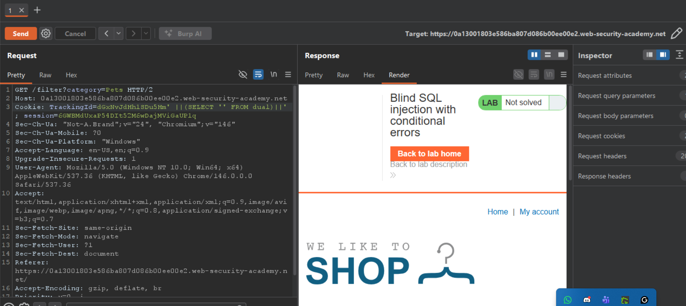
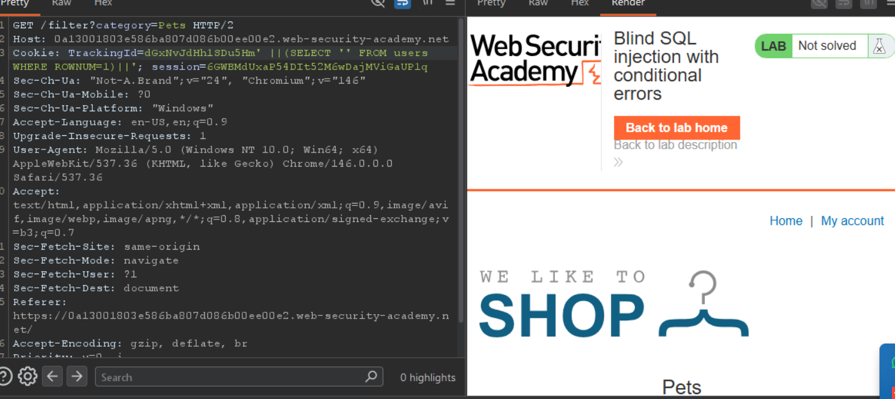
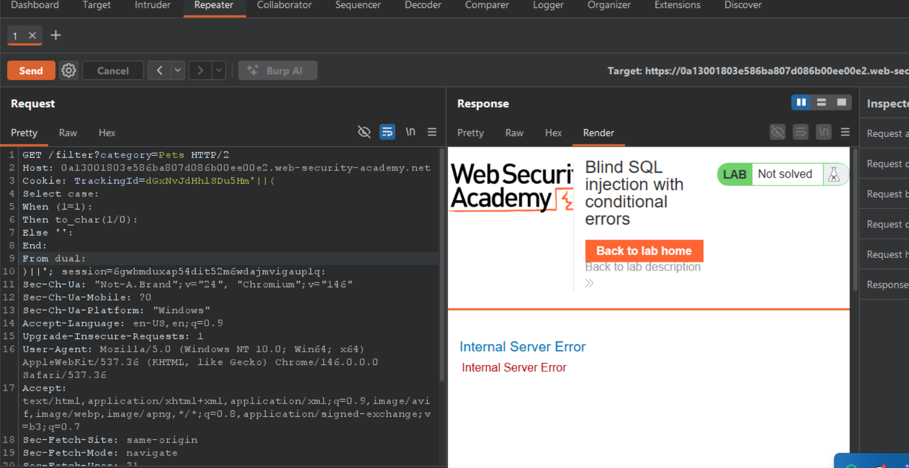
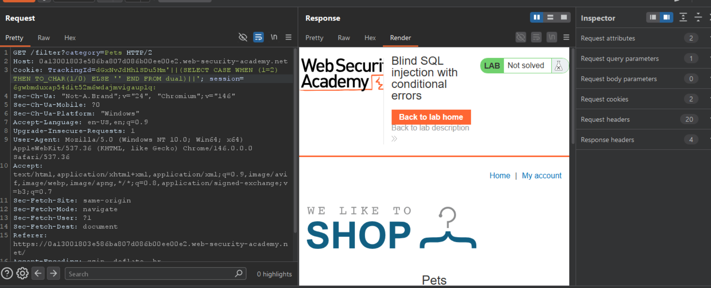
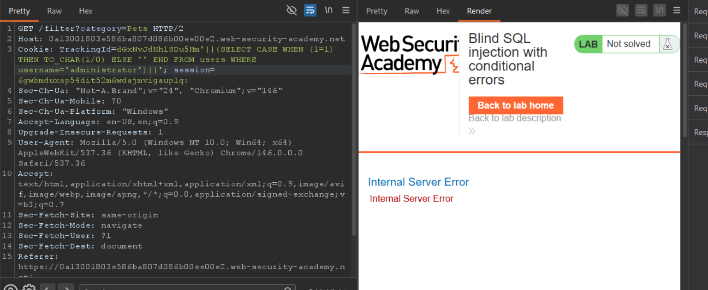
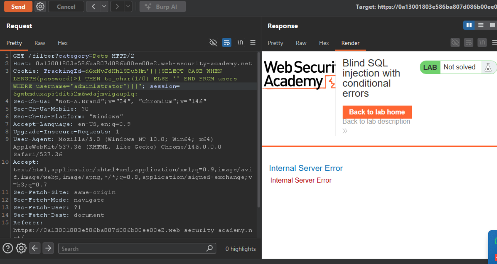
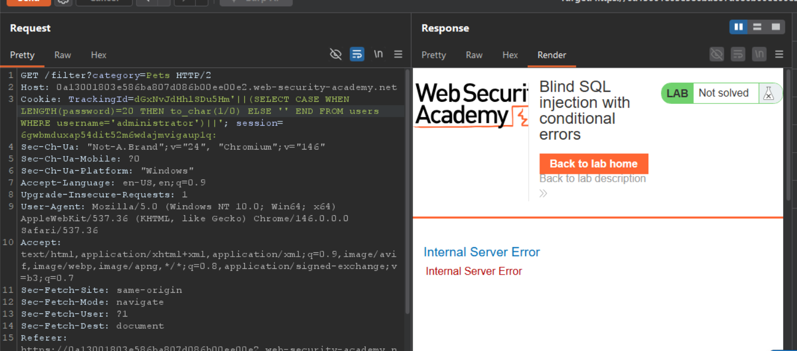
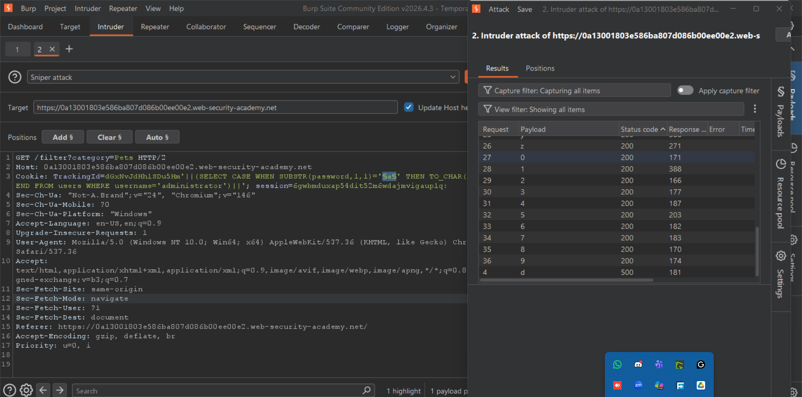
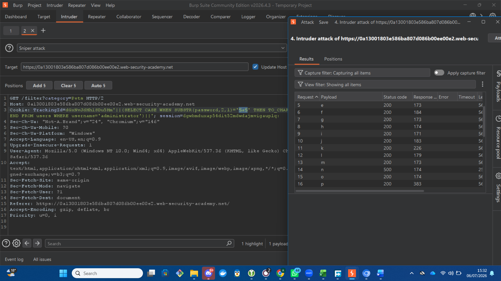

# Blind SQL Injection with Conditional Errors

## Table of Contents

- [Lab Information](#lab-information)
- [Goal of the Lab](#goal-of-the-lab)
- [Lab Overview](#lab-overview)
- [Vulnerability Overview](#vulnerability-overview)
- [Step 1: Appending a Single Quote to Confirm the Vulnerability](#step-1-appending-a-single-quote-to-confirm-the-vulnerability)
- [Step 2: Appending Two Single Quotes to Confirm SQL Syntax](#step-2-appending-two-single-quotes-to-confirm-sql-syntax)
- [Step 3: Identifying the Database](#step-3-identifying-the-database)
- [Step 4: Identifying Whether the users Table Exists](#step-4-identifying-whether-the-users-table-exists)
- [Step 5: Testing Conditional Errors, True Condition](#step-5-testing-conditional-errors-true-condition)
- [Step 6: Testing Conditional Errors, False Condition](#step-6-testing-conditional-errors-false-condition)
- [Step 7: Verifying the Administrator Account](#step-7-verifying-the-administrator-account)
- [Step 8: Determining the Administrator's Password Length](#step-8-determining-the-administrators-password-length)
- [Step 9: Extracting the Administrator's Password Using Burp Suite Intruder](#step-9-extracting-the-administrators-password-using-burp-suite-intruder)
- [Overall Conclusion](#overall-conclusion)

---

## Lab Information

- **Platform:** PortSwigger Web Security Academy
- **Category:** SQL Injection
- **Difficulty:** Apprentice

## Goal of the Lab

- Identify and exploit the blind SQL injection vulnerability in the TrackingId cookie.
- Confirm the injection point using conditional errors, since the application does not display a visible content difference between true and false conditions.
- Enumerate the password of the administrator user from the users table.
- Log in as the administrator account using the extracted password to successfully solve the lab.

## Lab Overview

This lab demonstrates a conditional error based blind SQL injection vulnerability where the value of the TrackingId cookie is incorporated into a SQL query on the back end. Unlike a conditional response lab, this application does not show a distinguishing message such as "Welcome back" when a condition is true. Instead, the only observable difference between a true and a false condition is whether the application returns its normal response or an HTTP 500 Internal Server Error. This means data must be extracted by forcing the database to throw an error when a condition is true, and to complete normally when the condition is false.

## Vulnerability Overview

This lab demonstrates Conditional Error based Blind SQL Injection. The attacker cannot view database output directly and cannot rely on differences in page content, since the application always renders the same content regardless of the query result. Instead, the attacker crafts a subquery that deliberately causes a database error, such as a division by zero, only when an injected condition is true.

- If the injected condition evaluates to **TRUE**, the database attempts the error causing operation and the application returns a 500 Internal Server Error.
- If the injected condition evaluates to **FALSE**, the error causing operation is skipped and the application returns its normal response.

By repeating this test with different conditions, it becomes possible to confirm the existence of database objects and extract data such as table names, usernames, and password characters, one piece at a time.

---

## Step 1: Appending a Single Quote to Confirm the Vulnerability

To begin testing the TrackingId cookie for SQL injection, I modified its value by appending a single quote.

**Explanation:** A single unescaped quote breaks the syntax of the underlying SQL query by introducing an unmatched quotation mark. If the cookie value is inserted into the query without proper sanitisation, this will cause the database to reject the malformed statement.

**Observation:** The application returned an Internal Server Error in response to the modified cookie value.

**Conclusion:** This confirms that the TrackingId cookie value is passed to the back end SQL query without adequate input validation, and that the application is vulnerable to SQL injection.

## Step 2: Appending Two Single Quotes to Confirm SQL Syntax

To verify that the error was caused by broken SQL syntax rather than some unrelated application fault, I appended two single quotes to the TrackingId value instead of one.

**Explanation:** In SQL, two consecutive single quotes inside a string literal are interpreted as an escaped quote character rather than the end of the string. This keeps the overall query syntax valid.

**Observation:** The application returned its normal response with no error.

**Conclusion:** The contrast between an error with one quote and a normal response with two quotes confirms that the cookie value is being interpreted as part of a SQL string literal. This further confirms the presence of the injection point and sets up the conditional error technique used in the following steps.

## Step 3: Identifying the Database

With the injection point confirmed, I tested the underlying database engine so that the correct syntax could be used for the conditional error payloads.

**Explanation:** This payload appends a subquery that only produces a database error when the tested condition is true, using a construct compatible with the identified database engine. Observing whether the request produces an error confirms both the database type and that arbitrary conditions can be injected into the query.

**Observation:** The request produced the expected conditional behavior, confirming the database engine and syntax to use for the remaining steps.

**Conclusion:** Identifying the database engine early made it possible to build accurate CASE based payloads for the rest of the enumeration process.

## Step 4: Identifying Whether the users Table Exists

Next, I tested whether the database contained a table named users, which is commonly used to store account credentials.

**Explanation:** The payload wraps a conditional error subquery around a reference to the users table. If the table exists, the query executes and the injected condition can trigger the error causing branch. If the table does not exist, the query fails for an unrelated reason and the result cannot be trusted.

**Observation:** The request behaved as expected for a table that exists, confirming that the users table is present in the database.

**Conclusion:** Confirming the existence of the users table provided a target for enumerating account information, including usernames and passwords.

## Step 5: Testing Conditional Errors, True Condition

To validate the conditional error technique itself, I injected a condition that always evaluates to TRUE.

**Explanation:** The payload uses a CASE statement so that when the injected condition is true, the query performs an operation that always fails, such as dividing by zero. A true condition should therefore force the database to raise an error.

**Observation:** The application returned an Internal Server Error.

**Conclusion:** This confirms that a true condition reliably produces an error, establishing the baseline behavior needed to interpret the results of later, more targeted conditions.

## Step 6: Testing Conditional Errors, False Condition

I then repeated the test using a condition that always evaluates to FALSE.

**Explanation:** When the injected condition is false, the CASE statement skips the error causing branch and the query completes normally, since the error causing operation is never executed.

**Observation:** The application returned its normal response with no error.

**Conclusion:** The contrast between the TRUE and FALSE conditions confirms that the conditional error technique is working correctly and can be used to test arbitrary true or false statements about the contents of the database.

## Step 7: Verifying the Administrator Account

Using the conditional error technique, I tested whether a user named administrator existed in the users table.

**Explanation:** The payload combines the conditional error subquery with a check against the username column, so the error is only triggered if a row with username equal to administrator exists in the users table.

**Observation:** The application returned an Internal Server Error, indicating the condition evaluated to TRUE.

**Conclusion:** This confirmed that the administrator account exists in the users table, identifying the target account for the password extraction phase of the attack.

## Step 8: Determining the Administrator's Password Length

With the target account confirmed, I used the conditional error technique together with the LENGTH function to determine how many characters are in the administrator's password.

**Explanation:** The payload checks whether the length of the administrator's password is greater than a specified number. If the condition is true, the error causing branch executes and the application returns a 500 error. By testing a range of values, for example greater than 1, greater than 10, and greater than 20, the exact password length can be narrowed down.

**Observation:** The application's response changed from an error to a normal response as the tested length crossed the true password length, allowing the exact number of characters to be identified.

**Conclusion:** Determining the exact password length made it possible to enumerate the password one character at a time using substring comparisons in the next step.

## Step 9: Extracting the Administrator's Password Using Burp Suite Intruder

With the password length known, I used Burp Suite Intruder to automate the extraction of each character in the password.

**Explanation:** The payload uses the SUBSTRING function to isolate a single character of the password at a given position, and compares it against a candidate character inside the conditional error CASE statement. If the comparison is true, the request triggers an error; if false, the application responds normally.

To automate this process, I configured Intruder using the Cluster Bomb attack type:

- **Position 1:** the character position within the password, from 1 to the confirmed password length.
- **Position 2:** candidate characters, covering the letters a to z and the digits 0 to 9.

Intruder generated a request for every combination of position and candidate character. By reviewing the HTTP status code of each response, I identified the correct character at each position based on which requests returned an error rather than the normal response.

**Observation:** Each position in the password produced exactly one candidate character that triggered an error, indicating the correct character at that position.

**Conclusion:** Repeating this process across all character positions allowed the complete administrator password to be reconstructed. Using Burp Suite Intruder significantly reduced the manual effort required, enabling efficient extraction of the full password through conditional error based blind SQL injection.

## Overall Conclusion

This lab demonstrated how blind SQL injection can be exploited even when an application provides no visible difference in content between true and false conditions. By forcing the database to raise an error only when an injected condition is true, it was possible to confirm the injection point, identify the database structure, and extract the administrator's password one character at a time. Logging in with the recovered password successfully solved the lab.
